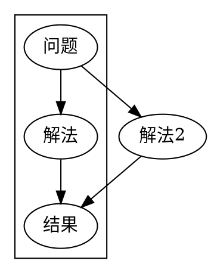

+++
title = "guide of emacs for vim user"
date = 2022-02-09T19:27:00+08:00
tags = ["PUBLIC"]
draft = false
+++

## 目标用户 {#目标用户}

### singularity追求者 {#singularity追求者}

## vim {#vim}

vim的modal editing模式非常受欢迎，尤其是以hjkl motion movement为核心的keybinding。

而vim keybinding比vim本身更加流行，浏览器 各种IDE，一些terminal都有vim keybinding。
所以值得一问：

我是喜欢vim还是喜欢vim keybinding

<!--more-->

## as elisp interpreter {#as-elisp-interpreter}

emacs最大的特点可能是emacs本身是一个emacs lisp的解释器，大部分emacs的代码都由elisp写成，包括配置文件本身。
与编辑器交互的command，也就是在解释器里执行新的function。

lisp本身是一个很有魅力的语言，简洁的语法，彻底的functional programming支持。
可以在经典教材[SICP]()中看到很全面的介绍。也可以参考Paul Graham的[lisp 洗脑文](http://www.paulgraham.com/lisp.html)。

另外一点值得一提的是这个lisp解释器的server-client结构。
vim和其他的编译器也有类似的结构，但是可能是因为语言的原因，使用的并不多。
而在emacs中就经常见到一些很灵活的操作，一个我比较喜欢的例子是：[org-pomodoro&amp;polybar](https://colekillian.com/posts/org-pomodoro-and-polybar/)
写一个shell script，通过 `emacsclient -e` 执行在emacs配置中声明的一个函数，获取一个文本输出。再把这个shell script放到桌面管理器status line的callback里，做到在桌面显示emacs内部的信息。

## org-mode {#org-mode}

org-mode直接看起来是一个类似markdown的东西，一种标记语法。



使它看起来独特的原因有下面几个点：

### structure editing {#structure-editing}

包括报表在内，有一套比较方便的键盘操作：交换章节、提高/降低层级、加TODO



### literal programming {#literal-programming}

类似jupyter，可以边写代码，边写文档，文档中可以直接包含代码的输出。



### GTD {#gtd}

一个永远准备 `capture` TODO项的GTD系统。

例如正在coding，可以使用 `org-capture` 加一个TODO

这部分的介绍太多了，应该是很多人入坑emacs的原因。
很多非程序员也在使用emacs，用org-mode做GTD应该算是一个比较主流的原因之一。

## we love UI: TUI &amp; GUI {#we-love-ui-tui-and-gui}

emacs是一个完整的GUI程序，所以能享受众多GUI程序的基本人权：

-   丰富的字体选择（不只是等宽字体）
-   内嵌图片，上面literal programming已经介绍过。也可以（在编辑过程中）嵌入渲染好的latex公式（实际上是图片）
-   鼠标点击和下拉菜单，很多TUI中的文字其实是按钮。

在GUI和command line两个极端之间，我认为TUI是非常吸引人的一个选项。

现在有一种潮流是用rust重写很多CLI工具，其中一个特点就是具有非常丰富的TUI。
[lazygit](https://github.com/jesseduffield/lazygit)应该算是一个非常有代表性的例子（虽然很快就要说到lazygit是在重复造一个emacs中存在已久的轮子）。

## magit {#magit}





magit是emacs中常用的git工具。想来想去觉得用下面这个文章最好说明他的设计思想：[Emacs is the 2D Command-line Interface](https://hongchao.me/cli-and-emacs/)。

magit是一个TUI工具，但是他每个显示的文字都是一个潜在的按钮。所以配合光标停留的位置，加上快捷键就可以表达verb+noun。

（好像想到了老罗的TNT）

## tramp {#tramp}

emacs中用来remote editing的工具。

vim常常被认为是适合远程编辑的：通过ssh登录，在terminal中执行vim。然后可怕的就来了，每次按键都要经历一次网络延迟。

这明显不是一个合理的设计，起码不适合长期工作。

VSCode中的remote设计的比较好（几乎和emacs一样好），编辑器会维护一个副本，隔离开高频的按键操作和低频的同步操作。

tramp是emacs中一个非常基础的模块，当你编辑一个远程文件的时候（文件名常常是类似 `user@host:/path/to/remote/file` ，甚至可以pipe， `user@host|docker:user@host:/path/to/remote/file` ），其他的插件几乎是可以开箱即用：

-   grep可以知道在远程搜索文件
-   language server知道应该索引远程的工程
-   magit也知道应该在远程做git操作

tramp的设计完成度很高，是一层很好的设计。

## 可维护度 {#可维护度}

vim的维护者主要是BM一个人。当初neovim之所以fork出来，就是因为一个关于async action的PR被BM拒绝了（当然后面又自己加上了，这个时候neovim已经分道扬镳了）。

neovim明显不打算跟vim保持兼容性了，从配置语言开始，neovim跟vim已经不是一个东西了，以后应该会差别越来越大。

谁知道以后会不会又有oenvim呢。

更可怕的是： ~~what if BM dies...~~ (2023.08.05 update，听闻BM去世了，我感到很抱歉和触动）

## plugin {#plugin}

基本说完了，plugin算是最不重要的了，几乎都有比较等价的实现。
不过还是说几个确实非常独特的plugin：

### org-roam {#org-roam}

可以认为是[roam research](https://roamresearch.com/)的开源实现。而roam research是[zettelkasten笔记法](https://en.wikipedia.org/wiki/Zettelkasten)的一个商业实现。

最近类似的note taking工具越来越多，简单总结这类工具就是尝试把过去常用的树形笔记结构，变成图的形状，靠各种双向链接来建造知识库。

### evil {#evil}

emacs中的vim keybinding。

感慨一下，实现一个vim的keybinding感觉还是非常麻烦的。。。佩服。

可惜的是很多vim的motion插件，自然是不能使用的。
